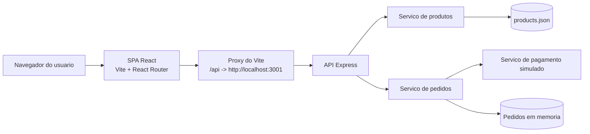
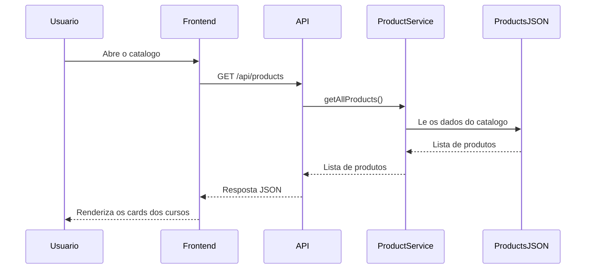
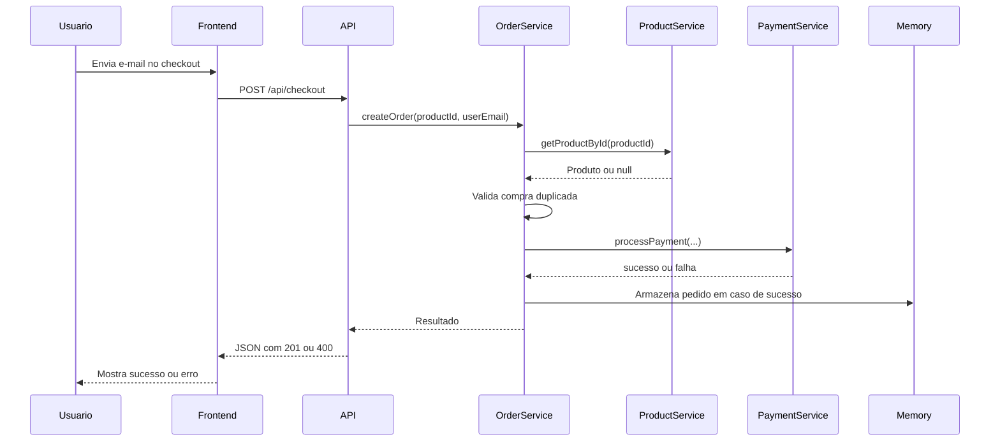

# Arquitetura LearnHub

Este documento descreve a arquitetura atualmente implementada neste repositorio. O conteudo reflete o codigo existente em `backend/` e `frontend/`, e nao uma arquitetura planejada para o futuro.

## Visao geral

LearnHub e uma plataforma enxuta de infoprodutos voltada para venda de cursos online. A aplicacao foi mantida simples de proposito para facilitar demos, workshops e iteracoes com GitHub Copilot.

Em alto nivel:

- o backend expõe endpoints de produtos, checkout, pedidos e health check com Express
- o frontend consome esses endpoints com `fetch`, usando o proxy de desenvolvimento do Vite
- o catalogo de cursos e carregado de um arquivo JSON local
- as compras ficam apenas em memoria, entao os pedidos se perdem quando o backend reinicia
- o pagamento e simulado por um servico fake com taxa de sucesso e falha

## Stack tecnologica

### Backend

- Node.js
- Express 4
- CORS
- `uuid` para gerar identificadores de pedido
- arquivo JSON local para dados do catalogo
- array em memoria para armazenar pedidos

### Frontend

- React 19
- React Router 7
- Vite 8
- Tailwind CSS 4 via plugin do Vite
- `fetch` nativo para chamadas HTTP

## Estrutura do repositorio

```text
backend/
  src/
    controllers/   Manipuladores das requisicoes HTTP
    routes/        Registro das rotas Express
    services/      Regras de negocio e integracoes
    data/          Dados estaticos em JSON
    index.js       Bootstrap do servidor

frontend/
  src/
    components/    Componentes compartilhados
    pages/         Telas da aplicacao
    services/      Funcoes clientes da API
    App.jsx        Definicao de rotas da SPA
    main.jsx       Bootstrap do React

docs/
  architecture.md  Este documento
  design/          Materiais de apoio visual
```

## Arquitetura em execucao



## Arquitetura do backend

O backend segue uma separacao simples por camadas:

- `routes/` mapeia URLs para controladores
- `controllers/` valida entradas e monta respostas HTTP
- `services/` concentra regras de negocio e integracoes simples
- `data/` contem os dados fixos do catalogo

### Fluxo de requisicao

1. Uma requisicao HTTP chega a uma rota do Express.
2. A rota delega o processamento a um controller.
3. O controller faz validacoes basicas e chama um service.
4. O service executa a regra de negocio, consulta produtos, processa o pagamento simulado ou recupera pedidos.
5. O controller devolve a resposta em JSON.

### Endpoints da API

| Metodo | Caminho | Responsabilidade |
| --- | --- | --- |
| `GET` | `/products` | Retorna o catalogo completo |
| `GET` | `/products/:id` | Retorna um curso por id |
| `POST` | `/checkout` | Valida dados, processa pagamento simulado e cria um pedido |
| `GET` | `/orders/:userEmail` | Retorna as compras associadas a um e-mail |
| `GET` | `/health` | Retorna status e timestamp da API |

### Componentes

#### Bootstrap da aplicacao

`backend/src/index.js` inicializa o Express, habilita CORS, registra o parser JSON, monta as rotas, expõe o health check e define os handlers de 404 e 500.

#### Modulo de produtos

- Rota: `backend/src/routes/products.js`
- Controller: `backend/src/controllers/productController.js`
- Service: `backend/src/services/productService.js`

Responsabilidades:

- carregar todos os cursos de `backend/src/data/products.json`
- retornar o catalogo completo
- retornar um produto especifico pelo id

Este modulo e somente leitura. Nao existe fluxo de criacao ou edicao de produtos.

#### Modulo de checkout

- Rota: `backend/src/routes/checkout.js`
- Controller: `backend/src/controllers/checkoutController.js`
- Services: `backend/src/services/orderService.js` e `backend/src/services/paymentService.js`

Responsabilidades:

- validar `productId` e `userEmail`
- rejeitar e-mails invalidos
- garantir que o produto exista
- impedir compra duplicada do mesmo curso para o mesmo e-mail
- chamar o servico de pagamento simulado
- gerar um `orderId` com `uuid`
- armazenar o pedido em memoria

#### Modulo de pedidos

- Rota: `backend/src/routes/orders.js`
- Controller: `backend/src/controllers/orderController.js`
- Service: `backend/src/services/orderService.js`

Responsabilidades:

- validar o parametro `userEmail`
- recuperar os pedidos em memoria desse e-mail
- retornar metadados do curso comprado e a URL do video incorporado

### Modelo de dados

#### Produto

Os produtos sao carregados de `backend/src/data/products.json` e possuem:

- `id`
- `title`
- `description`
- `price`
- `thumbnail`
- `videoUrl`

#### Pedido

Os pedidos sao gerados no checkout e ficam em memoria com os campos:

- `orderId`
- `productId`
- `userEmail`
- `product` como snapshot
- `transactionId`
- `purchasedAt`

O objeto `product` armazenado no pedido e uma copia do curso no momento da compra. Isso permite ao frontend renderizar o conteudo adquirido sem nova consulta ao catalogo.

### Estrategia de persistencia

A aplicacao usa dois modelos de armazenamento:

- produtos persistidos no repositorio como JSON estatico
- pedidos mantidos apenas em um array JavaScript em `orderService.js`

Essa e a principal limitacao operacional do backend atual.

Consequencias:

- os pedidos desaparecem apos reiniciar o backend
- os pedidos nao sao compartilhados entre multiplas instancias
- nao existe estrategia de durabilidade, bloqueio ou recuperacao
- o arquivo `backend/src/data/orders.json` nao participa do fluxo de execucao atual

### Abstracao de pagamento

`paymentService.js` implementa um gateway simulado que oferece:

- processamento assincrono com pequeno atraso
- taxa aproximada de 95% de aprovacao
- geracao de `transactionId` em caso de sucesso
- mensagem amigavel em caso de recusa

O servico foi isolado para que possa ser substituido futuramente por Stripe, PayPal ou outro provedor sem mudar o contrato do controller.

## Arquitetura do frontend

O frontend e uma single-page application em React organizada por paginas e componentes reutilizaveis.

### Rotas

`frontend/src/App.jsx` define o mapa principal da aplicacao:

- `/` renderiza o catalogo
- `/produto/:id` renderiza a pagina de detalhes do curso
- `/finalizar-compra/:productId` renderiza o formulario de compra
- `/meus-cursos` renderiza a tela de consulta de compras

O roteamento e tratado no cliente por meio do `BrowserRouter`.

### Responsabilidades por pagina

#### Home

`frontend/src/pages/Home.jsx`

- busca o catalogo completo ao montar a pagina
- exibe estados de carregamento e erro
- renderiza uma grade de `ProductCard`

#### Product Detail

`frontend/src/pages/ProductDetail.jsx`

- busca um produto pelo id da rota
- exibe capa, descricao, preco e destaques do curso
- direciona o usuario para o fluxo de compra

#### Checkout

`frontend/src/pages/Checkout.jsx`

- busca o produto selecionado
- coleta o e-mail do comprador
- chama a API de checkout
- exibe feedback de sucesso ou erro
- usa toasts para notificacoes

#### My Courses

`frontend/src/pages/MyCourses.jsx`

- recebe um e-mail
- busca todas as compras associadas a esse e-mail
- trata estados vazios, de carregamento e de erro
- expande um player de video incorporado para cada curso comprado

### Componentes compartilhados

A camada de componentes inclui:

- `Navbar` para navegacao principal
- `ProductCard` para os cards do catalogo
- `LoadingSpinner` para estados assincronos
- `Toast` para mensagens temporarias de sucesso, informacao e erro

Essa organizacao deixa as paginas focadas no fluxo de dados e na composicao da interface.

### Integracao com a API

`frontend/src/services/api.js` centraliza as requisicoes HTTP. O frontend conversa com `/api/...` em vez de chamar diretamente a origem do backend.

Durante o desenvolvimento, o `frontend/vite.config.js` aplica o seguinte proxy:

- `/api/products` -> `http://localhost:3001/products`
- `/api/checkout` -> `http://localhost:3001/checkout`
- `/api/orders/...` -> `http://localhost:3001/orders/...`

Isso reduz atrito com CORS no ambiente local e mantem um prefixo unico para as chamadas do frontend.

## Fluxos principais de negocio

### Navegacao pelo catalogo



### Fluxo de compra



### Recuperacao de cursos comprados

1. O usuario informa um e-mail na tela Meus Cursos.
2. O frontend chama `GET /api/orders/:userEmail`.
3. O backend valida o e-mail e filtra os pedidos em memoria.
4. O frontend renderiza os cursos encontrados e permite assistir ao video na propria pagina.

## Tratamento de erros

### Backend

- os controllers retornam `400` para entradas invalidas
- a busca de produto retorna `404` quando o id nao existe
- rotas desconhecidas retornam `404`
- erros nao tratados retornam `500`

### Frontend

- cada pagina com chamadas de API possui estados explicitos de carregamento e erro
- Checkout e Meus Cursos exibem erros via toast
- a camada `api.js` lanca excecoes em respostas nao OK para simplificar as paginas

## Caracteristicas nao funcionais

### Pontos fortes do desenho atual

- custo muito baixo para subir demos e workshops
- separacao clara entre rotas, controllers e services
- camada simples de integracao entre frontend e API
- facilidade para trocar o servico de pagamento por um provedor real
- base pequena e legivel, adequada para demonstracoes com Copilot

### Limitacoes atuais

- nao ha banco de dados nem persistencia duravel para pedidos
- nao ha autenticacao nem conta de usuario
- nao existe controle de autorizacao para acesso ao conteudo comprado
- nao existe rate limiting, estrategia de logs ou observabilidade
- nao ha validacao declarativa de schema, apenas checagens manuais
- nao existem testes automatizados no repositorio atual
- alteracoes no catalogo exigem edicao de arquivos de dados

## Caminho sugerido de evolucao

Se o projeto precisar ir alem do escopo de demo, os proximos passos naturais seriam:

1. substituir os pedidos em memoria por um banco de dados real
2. persistir historico de checkout e metadados de pagamento
3. adicionar autenticacao para vincular cursos a uma identidade, e nao apenas a um e-mail
4. introduzir validacao por schema com bibliotecas como Zod ou Joi
5. adicionar testes automatizados para services, controllers e fluxos criticos do frontend
6. configurar URLs e provedores por ambiente

## Resumo

Hoje o LearnHub e uma aplicacao web de duas camadas:

- um frontend React para catalogo, compra e acesso aos cursos
- um backend Express com uma API REST pequena e objetiva
- JSON estatico para o catalogo de produtos
- memoria de processo para o ciclo de vida dos pedidos

Essa arquitetura atende bem a demos, workshops e exercicios guiados com Copilot, mas ainda nao esta pronta para cargas de producao.